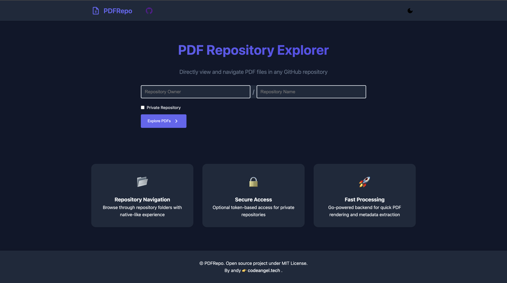
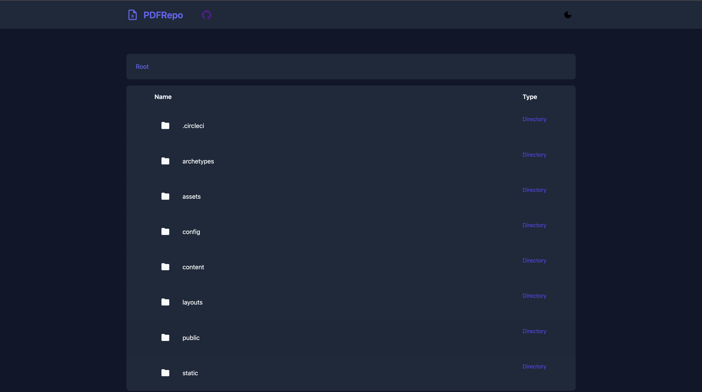
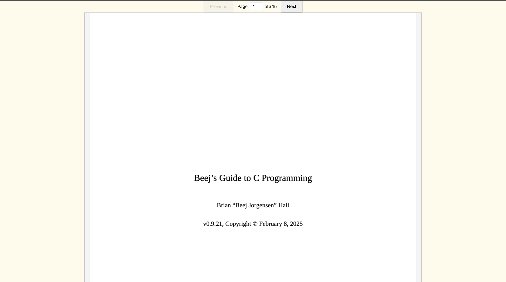

# PDFRepo: A go based performant pdf reader.

[](https://opensource.org/licenses/MIT)

PDF Repo Explorer is a web application that allows you to browse and view PDF files stored in GitHub repositories. It provides a clean and intuitive interface for navigating repository directories and previewing PDF files directly in your browser.

## Features

- 🗂️ Browse GitHub repository directories
- 📄 Preview PDF files directly in the browser
- 🌓 Light and dark theme support
- 🔒 Optional GitHub token for private repositories
- 🚀 Fast and lightweight Go backend

## Screenshots






## Getting Started

### Prerequisites

- Go 1.20+
- GitHub account (for accessing repositories)

### Installation

1. Clone the repository:
   ```bash
   git clone https://github.com/andy4747/pdfrepo.git
   cd pdfrepo
